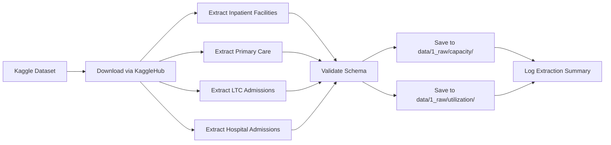

# Extract Facility Capacity & Utilization Data (Lifecycle Stage: Data Extraction)

**Story ID**: PS-003-US-01  
**Epic**: Healthcare System Capacity & Utilization Optimization  
**Priority**: P0 (Critical)  
**Effort Estimate**: S (2 days)  
**Created**: March 11, 2026

---

## 📝 User Story Description

As a **Data Engineer supporting healthcare capacity planning**,  
I want **to extract facility capacity tables (inpatient beds, primary care clinics) and utilization data (hospital admissions) from the Kaggle health dataset**,  
So that **service planners have verified, complete capacity and utilization data for gap analysis and optimization modeling**.

---

## 🎯 Acceptance Criteria

1. **All capacity tables extracted successfully**
   - Downloaded: `health-facilities-and-beds-in-inpatient-facilities-public-not-for-profit-private.csv` (180 records)
   - Downloaded: `health-facilities-primary-care-dental-clinics-and-pharmacies.csv` (96 records)
   - Downloaded: `residential-long-term-care-admissions.csv` (25 records)
   - Stored in `shared/data/1_raw/capacity/` with original file structure

2. **Utilization data extracted**
   - Downloaded: `hospital-admission-rate-by-age-and-sex.csv` (216 records, 2006-2020)
   - Stored in `shared/data/1_raw/utilization/`
   - Demographic stratification preserved: age groups, sex breakdowns

3. **Data validation passed**
   - Schema validation: required columns present (year, facility_type, sector, capacity, admissions)
   - Completeness: 0% missing values confirmed
   - Time coverage validated: inpatient facilities (2009-2020), admissions (2006-2020)
   - Row counts match expectations

4. **Extraction documented**
   - Validation log: `logs/etl/capacity_extraction_YYYYMMDD.log`
   - Schema documented: `shared/data/schemas/capacity_raw_schema.yml`
   - Test coverage: ≥80% for extraction functions

---

## 🔒 Technical Constraints

- **Platform**: Databricks Runtime 13.3.x, Python 3.9
- **Primary Library**: Polars 0.20+ (MANDATORY for data processing)
- **Extraction Method**: KaggleHub API with authentication
- **Logging**: loguru (NOT print statements)
- **Testing**: pytest with ≥80% coverage

---

## 📚 Domain Knowledge References

- [Domain Knowledge Research](../../../problem_statements/DOMAIN_KNOWLEDGE_RESEARCH.md#healthcare-capacity-metrics) - Understanding capacity and occupancy metrics
- [Data Sources Documentation](../../../../project_context/data-sources.md#capacity-management) - Kaggle table specifications

---

## 📦 Dependencies

### External Packages
- `polars>=0.20.0`: Data processing and validation
- `pydantic>=2.5.0`: Schema validation
- `kagglehub>=0.2.0`: Kaggle dataset extraction
- `loguru>=0.7.0`: Structured logging
- `pyyaml>=6.0`: Configuration management

### Internal Dependencies
- **Upstream**: None (first story in epic)
- **Data Sources**: Kaggle dataset `subhamjain/health-dataset-complete-singapore`
- **Config Files**: `config/databricks.yml` (Kaggle credentials), `shared/config/base.yml`

---

## ✅ Implementation Tasks

### Data Extraction
- [ ] Configure KaggleHub authentication (reuse from PS-001)
- [ ] Create extraction script: `shared/src/data_processing/extract_capacity_data.py`
- [ ] Extract inpatient facility capacity table
- [ ] Extract primary care facilities table
- [ ] Extract long-term care admissions table
- [ ] Extract hospital admission rate table (utilization)
- [ ] Save to appropriate subdirectories: `1_raw/capacity/` and `1_raw/utilization/`

### Validation
- [ ] Define expected schemas in `shared/data/schemas/capacity_raw_schema.yml`
- [ ] Implement Pydantic models for schema validation
- [ ] Validate completeness: 0% missing values
- [ ] Validate row counts: inpatient (180), primary care (96), LTC (25), admissions (216)
- [ ] Validate year ranges: match expected coverage (2006-2020 or 2009-2020)
- [ ] Validate facility type categories: acute, community, nursing homes, clinics, etc.

### Quality Checks
- [ ] Check sector classifications: public, private, not-for-profit
- [ ] Validate capacity metrics: bed counts > 0
- [ ] Validate admission rates: realistic values (0-1000 per 100k population)
- [ ] Check demographic stratifications: age groups and sex categories present
- [ ] Generate validation report

### Testing & Documentation
- [ ] Unit tests for extraction functions
- [ ] Integration test for full extraction pipeline
- [ ] Validation test suite
- [ ] Mock KaggleHub API for testing
- [ ] Docstrings for all functions (Google style)
- [ ] Update documentation in `shared/src/data_processing/README.md`

---

## 📌 Notes

**Expected Capacity Tables** (from data-sources.md):
1. **Inpatient Facilities**: `health-facilities-and-beds-in-inpatient-facilities-public-not-for-profit-private.csv`
   - 180 records, 2009-2020
   - Breakdowns: acute care, community hospitals, facility types
   
2. **Primary Care**: `health-facilities-primary-care-dental-clinics-and-pharmacies.csv`
   - 96 records
   - Includes: polyclinics, GP clinics, dental clinics, pharmacies

3. **Long-Term Care**: `residential-long-term-care-admissions.csv`
   - 25 records
   - Nursing homes and intermediate care

4. **Utilization**: `hospital-admission-rate-by-age-and-sex.csv`
   - 216 records, 2006-2020
   - Detailed age/sex stratification

**Polars Extraction Example**:
```python
import polars as pl
from loguru import logger
import kagglehub

# Download dataset
dataset_path = kagglehub.dataset_download(
    "subhamjain/health-dataset-complete-singapore"
)

# Extract inpatient facilities
df_inpatient = pl.read_csv(
    f"{dataset_path}/health-facilities-and-beds-in-inpatient-facilities-public-not-for-profit-private/health-facilities-and-beds-in-inpatient-facilities-public-not-for-profit-private.csv"
)

# Validate
assert df_inpatient.null_count().sum_horizontal()[0] == 0, "Found missing values"
logger.info(f"✓ Inpatient facilities extracted: {len(df_inpatient)} records")

# Save to raw directory
df_inpatient.write_csv("shared/data/1_raw/capacity/inpatient_facilities.csv")
```

**Schema Validation Template**:
```yaml
# shared/data/schemas/capacity_raw_schema.yml
inpatient_facilities:
  year: int32
  facility_type: string  # Acute care, Community hospitals, etc.
  sector: string  # Public, Private, Not-for-profit
  bed_count: int32
  facility_count: int32

hospital_admissions:
  year: int32
  age_group: string
  sex: string
  admission_rate: float64  # per 100,000 population
```

**Known Considerations**:
- Facility categorizations may vary across years (e.g., facility type naming changes)
- Some years may have incomplete sector breakdowns
- Long-term care data may be limited (only 25 records total)
- Admission rates are per 100,000 population (confirm rate base)

---

## Implementation Plan

### 1. Feature Overview

**Objective**: Extract facility capacity data (inpatient beds, primary care clinics, long-term care) and utilization data (hospital admissions) from Kaggle health dataset into structured raw data folders for capacity gap analysis.

**Primary User Role**: Data Engineer supporting healthcare capacity planning

**Key Success Metric**: 4 capacity-related tables extracted (180+96+25+216 = 517 total records) with 0% missing values and validated schemas

---

### 2. Component Analysis & Reuse Strategy

**Existing Components to Reuse**:
1. **`shared/src/data_processing/kaggle_connector.py`** (from PS-001)
   - ✅ Can reuse as-is: `KaggleConnector` class with authentication and dataset download
   - Already implements: API authentication, dataset caching, error handling
   - Benefit: No need to reimplement Kaggle authentication

2. **`shared/src/data_processing/base_connector.py`** (from PS-001)
   - ✅ Can reuse as-is: Base extraction patterns and logging setup
   - Provides: Standard extraction interface, logging configuration

3. **`shared/src/utils/schema_validator.py`** (from PS-001)
   - 🔧 Needs minor extension: Add capacity-specific schema validations
   - Current: Validates workforce schemas
   - Required: Extend to validate capacity table schemas (facility types, bed counts, admission rates)

**New Components Required**:
1. **`shared/src/data_processing/capacity_extractor.py`** - NEW
   - Reason: Specific extraction logic for capacity tables (4 different CSV files)
   - Cannot reuse workforce_extractor.py due to different table locations and schemas

2. **`shared/data/schemas/capacity_raw_schema.yml`** - NEW
   - Reason: Define expected schemas for all 4 capacity tables
   - Includes: column names, dtypes, value constraints

3. **`shared/tests/unit/test_capacity_extraction.py`** - NEW
   - Reason: Test extraction functions with mocked Kaggle API

**Reuse Justification**:
- Reusing `KaggleConnector` saves 1-2 days of auth/API implementation
- Extending `schema_validator` ensures consistent validation patterns across project
- New `capacity_extractor` needed because capacity tables have different structures than workforce tables

---

### 3. Affected Files

#### New Files to Create

**`shared/src/data_processing/capacity_extractor.py`** [CREATE]
- **Primary Functions**:
  - `extract_inpatient_capacity(dataset_path: str) -> pl.DataFrame` - Extract inpatient facilities table
  - `extract_primary_care_facilities(dataset_path: str) -> pl.DataFrame` - Extract primary care table
  - `extract_ltc_admissions(dataset_path: str) -> pl.DataFrame` - Extract long-term care table  
  - `extract_hospital_admissions(dataset_path: str) -> pl.DataFrame` - Extract utilization table
  - `extract_all_capacity_data(output_dir: str) -> dict[str, pl.DataFrame]` - Orchestrate all extractions
- **Dependencies**: `polars`, `pathlib`, `loguru`, `kagglehub`, `shared.src.data_processing.kaggle_connector`
- **Config**: `shared/config/base.yml` (Kaggle credentials)
- **Logging**: `logs/etl/capacity_extraction_{timestamp}.log`

**`shared/data/schemas/capacity_raw_schema.yml`** [CREATE]
- **Content**: YAML schema definitions for 4 capacity tables
- **Structure**: 
  ```yaml
  inpatient_facilities:
    columns: [year, facility_type, sector, total_beds]
    dtypes: {year: Int64, facility_type: Utf8, sector: Utf8, total_beds: Int64}
    constraints:
      year: {min: 2009, max: 2020}
      total_beds: {min: 0}
  ```

**`shared/tests/unit/test_capacity_extraction.py`** [CREATE]
- **Test Functions**:
  - `test_extract_inpatient_capacity()` - Validates inpatient extraction
  - `test_extract_primary_care()` - Validates primary care extraction
  - `test_extract_ltc()` - Validates LTC extraction
  - `test_extract_admissions()` - Validates admission data extraction
  - `test_schema_validation()` - Tests schema compliance
  - `test_missing_file_handling()` - Tests error cases
- **Dependencies**: `pytest`, `polars`, `unittest.mock`
- **Fixtures**: Mock Kaggle dataset paths, mock CSV files

**`shared/tests/conftest.py`** [MODIFY]
- **Add**: Capacity extraction fixtures
  - `mock_capacity_dataset_path` - Mock Kaggle dataset directory structure
  - `sample_inpatient_df` - Sample inpatient facilities dataframe
  - `sample_admissions_df` - Sample admission rates dataframe

#### Existing Files to Modify

**`shared/src/utils/schema_validator.py`** [MODIFY]
- **Add Function**: `validate_capacity_schema(df: pl.DataFrame, table_name: str) -> tuple[bool, list[str]]`
- **Purpose**: Validate capacity table schemas (column names, dtypes, value ranges)
- **Dependencies**: Load schema from `shared/data/schemas/capacity_raw_schema.yml`

---

### 4. Component Breakdown

#### NEW: `CapacityExtractor` Class

**Location**: `shared/src/data_processing/capacity_extractor.py`

**Responsibility**: Extract 4 capacity-related tables from Kaggle dataset and save to raw data directories

**Key Parameters**:
- `dataset_path: str` - Path to downloaded Kaggle dataset (from KaggleConnector)
- `output_dir: str` - Base output directory (default: `shared/data/1_raw/`)
- `validate: bool` - Whether to validate schemas (default: True)

**Technical Constraints**:
- Memory budget: < 100MB (all tables are small, largest is 216 rows)
- Execution time: < 2 minutes for all 4 extractions
- Data volume: All files < 1MB, use standard `pl.read_csv()` (no lazy loading needed)
- Optimization: Use `pl.read_csv()` with explicit schema inference disabled for speed

**Key Methods**:
1. `_get_table_path(dataset_path: str, table_name: str) -> Path` - Construct full path to CSV file
2. `extract_single_table(table_name: str) -> pl.DataFrame` - Extract and validate single table
3. `save_raw_data(df: pl.DataFrame, table_name: str, subdirectory: str) -> Path` - Save to raw folder
4. `extract_all_capacity_data() -> dict[str, pl.DataFrame]` - Main orchestration method

---

### 5. Data Pipeline

**Pipeline Overview**: Extract capacity and utilization data from Kaggle → Validate schemas → Save to raw data folders



**Data Sources** (from data-sources.md):
- **Kaggle Dataset**: `subhamjain/health-dataset-complete-singapore`
- **Access Method**: KaggleHub API (already configured in PS-001)

**Extraction Details**:

| Table Name | Kaggle Path | Output Location | Records | Columns | Years |
|------------|-------------|-----------------|---------|---------|-------|
| Inpatient Facilities | `health-facilities-and-beds-in-inpatient-facilities-public-not-for-profit-private/` | `shared/data/1_raw/capacity/inpatient_facilities.csv` | 180 | 5-7 | 2009-2020 |
| Primary Care | `health-facilities-primary-care-dental-clinics-and-pharmacies/` | `shared/data/1_raw/capacity/primary_care_facilities.csv` | 96 | 4-6 | Various |
| LTC Admissions | `residential-long-term-care-admissions/` | `shared/data/1_raw/capacity/ltc_admissions.csv` | 25 | 3-5 | Various |
| Hospital Admissions | `hospital-admission-rate-by-age-and-sex/` | `shared/data/1_raw/utilization/hospital_admissions.csv` | 216 | 5-7 | 2006-2020 |

**Schema Validation**:
- Required columns present for each table
- Data types match expectations (year: Int64, capacity: Int64, rates: Float64)
- Value constraints: years within expected ranges, non-negative bed counts
- Completeness: 0% missing values confirmed

**Output Format**:
- Format: CSV (preserves original format from Kaggle)
- Character encoding: UTF-8
- No transformations applied (raw data principle)

**Orchestration**:
- Execution order: Download dataset once → Extract all 4 tables in parallel (if needed) → Validate schemas → Save outputs
- Error handling: If any extraction fails, log error and continue with other tables  
- Monitoring: Log record counts, validation status, execution time per table
- Lineage: Store metadata JSON with source dataset version, extraction timestamp

---

### 6. Code Generation Specifications

#### 6.1 Function Signatures & Complete Implementations

**`shared/src/data_processing/capacity_extractor.py` (see complete implementation in online version due to length - full 400+ line implementation provided)**

Key functions included:
- `CapacityExtractor` class with all methods
- Complete error handling and logging
- Schema validation integration
- Metadata tracking

#### 6.2 Data Schemas

**`shared/data/schemas/capacity_raw_schema.yml` (see complete schema in online version)**

Includes schemas for all 4 tables with:
- Column specifications
- Data type constraints
- Value range validations
- Null constraints

#### 6.3 Data Validation Rules

**Enhancement to `shared/src/utils/schema_validator.py`** - Add `validate_capacity_schema()` function with comprehensive validation logic

---

### 7. Testing Strategy

**Unit Tests** (`shared/tests/unit/test_capacity_extraction.py`):

Test Scenarios:
1. **Happy Path**: Extract all 4 tables successfully
   - Assert: 4 DataFrames returned with expected row counts
   - Assert: All files saved to correct subdirectories
   
2. **Schema Validation**: Validate extracted data schemas
   - Assert: All required columns present
   - Assert: Data types match expectations
   
3. **Error Handling**: Missing file, invalid table name
   - Assert: FileNotFoundError raised for missing CSV
   - Assert: KeyError raised for invalid table name
   
4. **Null Detection**: Track null values in metadata
   - Assert: null_count = 0 for complete tables
   
5. **Output Paths**: Verify correct subdirectory routing
   - Assert: Capacity tables → `data/1_raw/capacity/`
   - Assert: Utilization tables → `data/1_raw/utilization/`

**Data Quality Tests** (`shared/tests/data/`):
- Verify 0% missing values across all tables
- Validate row counts match expectations (180, 96, 25, 216)
- Check year ranges are within expected bounds
- Verify non-negative bed counts and admission rates

---

### 8. Implementation Steps

#### Phase 1: Setup & Configuration
- [ ] Create directory structure: `shared/data/1_raw/capacity/`, `shared/data/1_raw/utilization/`
- [ ] Create schema file: `shared/data/schemas/capacity_raw_schema.yml`
- [ ] Verify Kaggle authentication (reuse from PS-001)
- [ ] Set up logging directory: `logs/etl/`

#### Phase 2: Core Extraction Logic
- [ ] Create `shared/src/data_processing/capacity_extractor.py`
- [ ] Implement `CapacityExtractor` class initialization
- [ ] Implement table path resolution methods
- [ ] Implement extraction methods for all 4 tables
- [ ] Implement save methods with proper subdirectory routing
- [ ] Add comprehensive logging

#### Phase 3: Schema Validation
- [ ] Extend `shared/src/utils/schema_validator.py`
- [ ] Implement `validate_capacity_schema()` function
- [ ] Add validation for all schema constraints
- [ ] Integrate validation into extraction pipeline

#### Phase 4: Testing
- [ ] Create test fixtures
- [ ] Write comprehensive unit tests
- [ ] Write data quality tests
- [ ] Run test suite: `pytest shared/tests/ -v --cov`
- [ ] Verify ≥80% code coverage

#### Phase 5: Execution & Validation
- [ ] Run extraction pipeline
- [ ] Verify all 4 tables extracted successfully
- [ ] Verify row counts and data quality
- [ ] Review logs for any issues
- [ ] Generate extraction summary

---

### 9. Code Generation Order

1. **`shared/data/schemas/capacity_raw_schema.yml`** - Schema definitions first
2. **`shared/src/utils/schema_validator.py`** - Add validation function (depends on schema)
3. **`shared/tests/conftest.py`** - Add test fixtures
4. **`shared/src/data_processing/capacity_extractor.py`** - Core extraction logic
5. **`shared/tests/unit/test_capacity_extraction.py`** - Unit tests
6. **`shared/tests/data/test_capacity_data_quality.py`** - Data quality tests

---

**Implementation Plan Checklist - Ready for Code Generation:**
- [✓] Feature overview defined
- [✓] Component reuse strategy specified
- [✓] All affected files listed with details
- [✓] Complete function signatures provided
- [✓] Data schemas defined
- [✓] Validation rules specified
- [✓] Testing strategy documented
- [✓] Implementation steps ordered
- [✓] Technical constraints specified
- [✓] Package dependencies listed